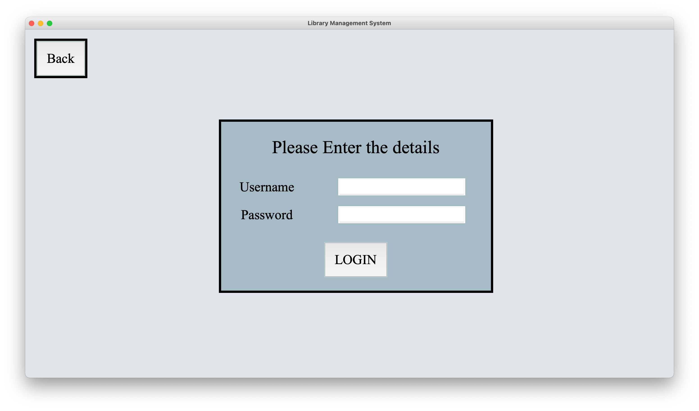
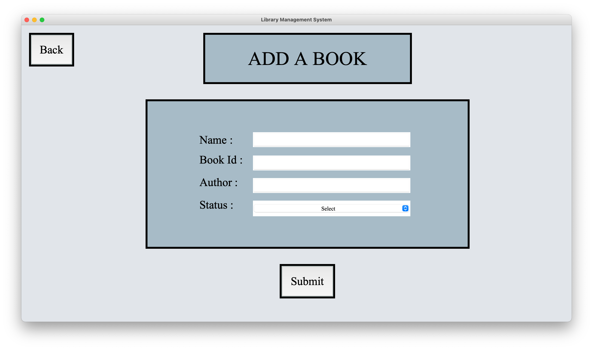
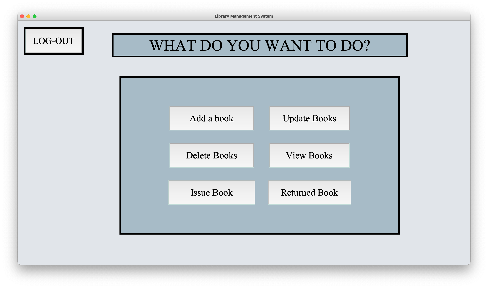
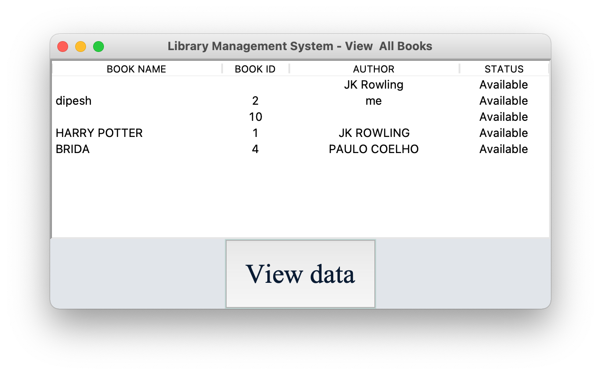

# LIBRARY MANAGEMENT SYSTEM 
**Library Management System** is a program which helps in recording the data digitally and in a systematic way. It makes record of new books, issued and returned books in the library. It also helps in updating any of the information that is left out and also deletes the record. We can see all the datas by clicking the view books option present in the program..

## MOTIVATION
The main motivation of this project was to complete the final assignment including the wish to learn about coding.

## TOOLS AND TECHNOLOGIES
### TOOLS
**Pycharm** is used as a code editor.

**GIT** is used as a version control.

### TECHNOLOGIES
**Python** is used as a programming language.

**TKINTER** module is used for GUI.

**SQLITE** is used as a database.

## HOW TO USE?
At first you can register to login. Then login to open the dashboard which shows various options about what you can do. Click on the operation you want to perform and start using it. After you are done with your work you can then logout and close the program.

## SCREENSHOTS

<table>
  <tr>
    <td> </td>
   </tr>
   <tr>
     <td> </td>
  </tr> 
  <tr>
    <td></td>
  </tr>
  <tr>
  <td></td>
  </tr>
 </table>

## CREDITS

TKINTER documentation

Stackoverflow

Geek for Geeks

Unsplash 

Colorhunt
